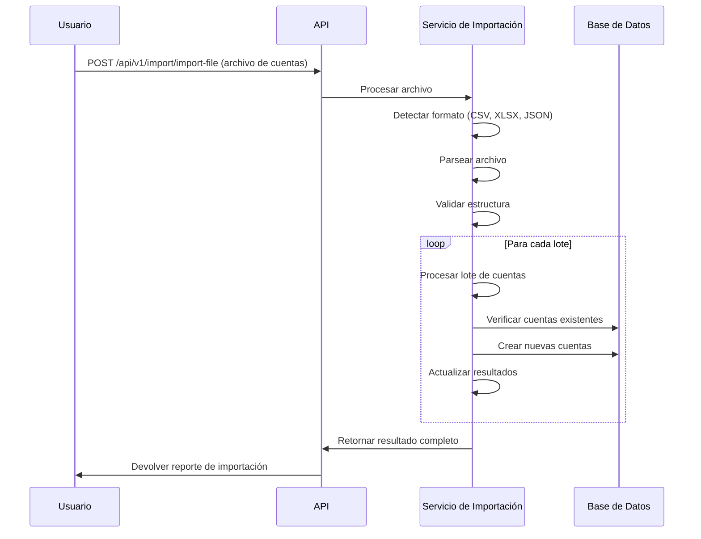
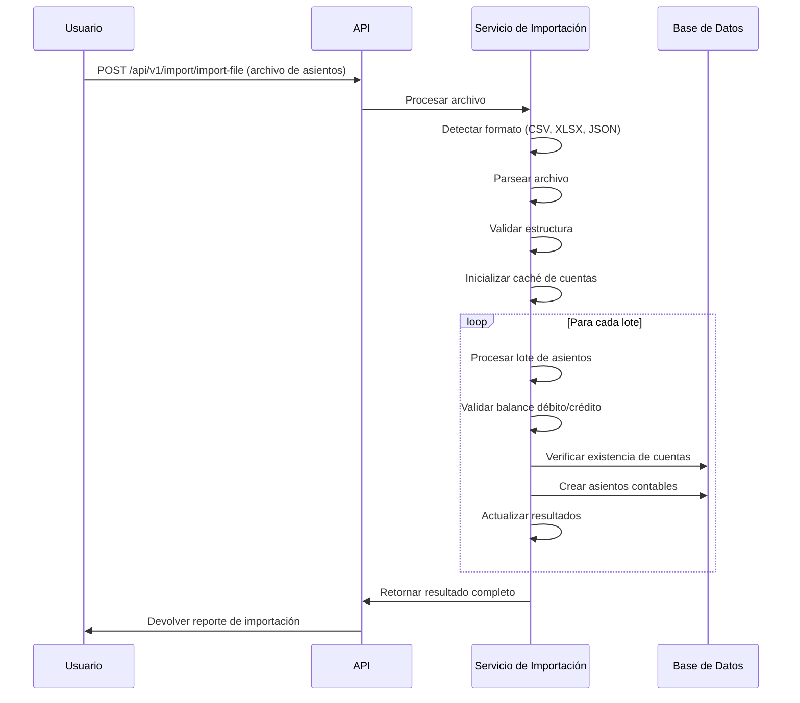

# Procesos de Importación

Este documento detalla los procesos y flujos de trabajo para importar datos en el sistema API Contable.

## Flujos de Trabajo de Importación

### 1. Flujo de Trabajo Completo

1. **Preparación de Datos**
   - Selección del tipo de datos a importar
   - Descarga de plantilla en el formato deseado
   - Completar los datos en la plantilla

2. **Previsualización y Validación**
   - Carga del archivo para previsualizar
   - Análisis automático del formato y estructura
   - Validación previa de los datos
   - Revisión de recomendaciones del sistema

3. **Configuración de Importación**
   - Definición del nivel de validación
   - Configuración del comportamiento ante duplicados
   - Configuración del comportamiento ante errores

4. **Procesamiento**
   - Ejecución de la importación
   - Procesamiento por lotes
   - Monitoreo del progreso

5. **Revisión de Resultados**
   - Análisis del reporte de importación
   - Revisión de errores y advertencias
   - Verificación de datos importados

### 2. Flujo Simplificado de Importación de Cuentas

1. Descargar plantilla de cuentas en formato preferido
2. Completar datos de las cuentas siguiendo la estructura
3. Cargar el archivo para previsualización
4. Validar estructura y datos
5. Ejecutar importación
6. Revisar resultado final

### 3. Flujo Simplificado de Importación de Asientos

1. Descargar plantilla de asientos en formato preferido
2. Completar datos de los asientos siguiendo la estructura
3. Cargar el archivo para previsualización
4. Validar estructura y datos (balance de débitos y créditos)
5. Ejecutar importación
6. Revisar resultado final

## Procesos Internos de Importación

### Detección de Formato

El sistema detecta automáticamente el formato del archivo basado en:

1. Extensión del archivo:
   - `.csv` para formato CSV
   - `.xlsx` o `.xls` para Excel
   - `.json` para JSON

2. Análisis del contenido del archivo cuando la extensión no es clara

### Análisis y Mapeo

1. **Parseo Inicial**:
   - Lectura de las primeras filas para análisis
   - Detección de estructura de columnas
   - Validación preliminar de formato

2. **Mapeo de Columnas**:
   - Identificación automática de columnas basada en nombres comunes
   - Generación de mapeo entre columnas del archivo y campos del sistema
   - Sugerencias para columnas no identificadas

### Validación

El sistema aplica múltiples niveles de validación:

1. **Validación de Estructura**:
   - Presencia de columnas requeridas
   - Formato adecuado del archivo
   - Estructura general correcta

2. **Validación de Tipos de Datos**:
   - Conversión y validación de tipos (fechas, números, etc.)
   - Validación de rangos y formatos específicos

3. **Validación de Reglas de Negocio**:
   - Para cuentas: unicidad de código, validez de tipos y categorías, etc.
   - Para asientos: balance débito/crédito, existencia de cuentas, etc.

4. **Validación de Integridad Referencial**:
   - Verificación de existencia de entidades referenciadas
   - Validación de jerarquías y relaciones

### Procesamiento por Lotes

El sistema procesa los datos en lotes para optimizar rendimiento:

1. **División en Lotes**:
   - Segmentación de datos en lotes configurables (default: 100 registros)

2. **Procesamiento Secuencial**:
   - Procesamiento ordenado de cada lote
   - Commit a base de datos por lote para evitar transacciones largas

3. **Manejo de Errores por Lote**:
   - Registro de errores específicos por fila
   - Decisión de continuar o abortar según configuración

4. **Caché y Optimización**:
   - Uso de caché para entidades frecuentemente referenciadas
   - Optimización de consultas para procesamiento rápido

### Reporte de Resultados

Al finalizar la importación, se genera un reporte detallado:

1. **Estadísticas Generales**:
   - Total de filas procesadas
   - Número de registros exitosos, con error y omitidos
   - Tiempo de procesamiento

2. **Resultados por Fila**:
   - Estado de cada fila procesada
   - Errores y advertencias específicos
   - IDs y códigos de entidades creadas

3. **Análisis de Errores**:
   - Errores más comunes y su frecuencia
   - Errores globales que afectaron todo el proceso

## Ejemplos de Procesos de Importación

### Ejemplo: Importación de Cuentas

### Ejemplo: Importación de Asientos Contables

## Manejo de Errores y Excepciones

### Tipos de Errores

1. **Errores de Validación**:
   - Datos faltantes o incorrectos
   - Estructura inválida
   - Reglas de negocio no cumplidas

2. **Errores de Negocio**:
   - Duplicados
   - Referencias inválidas
   - Conflictos con datos existentes

3. **Errores de Sistema**:
   - Problemas de conexión
   - Excepciones no controladas
   - Límites de recursos

### Estrategias de Manejo

El sistema ofrece estrategias configurables para manejar errores:

1. **Estricto (default)**:
   - Detiene el proceso ante cualquier error
   - Rollback completo para mantener integridad

2. **Tolerante**:
   - Continúa procesando a pesar de errores
   - Registra detalladamente errores para revisión
   - Procesa lo que es posible procesar

3. **Omisión de Duplicados**:
   - Omite registros duplicados
   - Registra como advertencia, no como error
   - Continúa con el resto de los registros

## Consideraciones de Rendimiento

Para optimizar el rendimiento del proceso de importación:

1. **Tamaño Óptimo de Lote**:
   - Para archivos pequeños (<1000 filas): 100 registros por lote
   - Para archivos medianos (<10000 filas): 500 registros por lote
   - Para archivos grandes (>10000 filas): 1000 registros por lote

2. **Uso de Caché**:
   - El sistema almacena en caché entidades frecuentemente referenciadas
   - Reduce consultas repetitivas a la base de datos

3. **Límites del Sistema**:
   - Tamaño máximo de archivo: 10MB
   - Número máximo recomendado de filas por operación: 50,000
   - Para volúmenes mayores, se recomienda dividir en múltiples operaciones

4. **Tiempos de Procesamiento Esperados**:
   - Cuentas: ~500 por minuto
   - Asientos simples: ~200 por minuto
   - Asientos complejos: ~100 por minuto

## Buenas Prácticas para Importación

1. **Preparación de Datos**:
   - Usar las plantillas proporcionadas por el sistema
   - Validar datos antes de intentar importar
   - Normalizar y limpiar datos externamente

2. **Proceso Recomendado**:
   - Siempre utilizar primero la previsualización
   - Revisar errores y advertencias antes de importar
   - Empezar con archivos pequeños para pruebas

3. **Mitigación de Riesgos**:
   - Realizar respaldos antes de importaciones grandes
   - Probar en ambiente de prueba antes de producción
   - Documentar y planificar importaciones significativas
