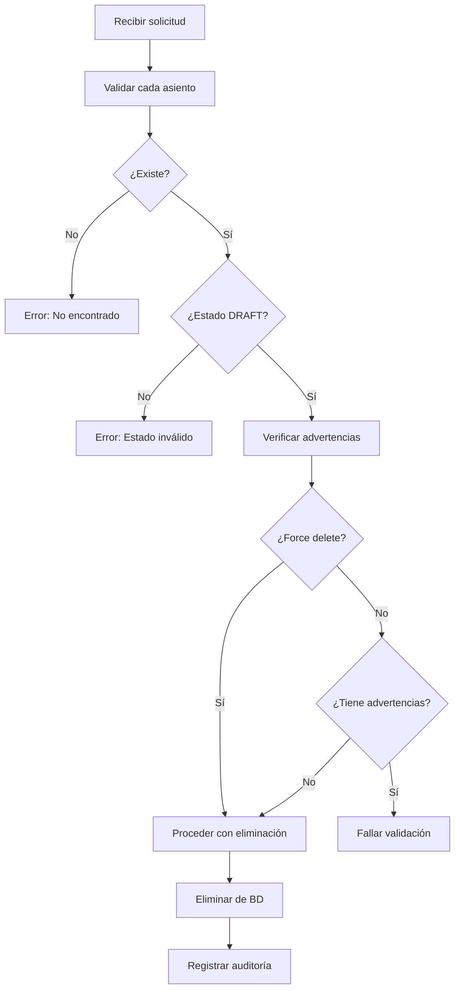

# Sistema de Eliminación Masiva de Asientos Contables

## 📋 Resumen del Sistema Implementado

Este documento describe el sistema completo de eliminación masiva de asientos contables implementado en la API Contable, siguiendo las mejores prácticas de seguridad, validación y auditoría.

## 🎯 Objetivo

Implementar un sistema robusto y seguro para eliminar múltiples asientos contables en una sola operación, con validaciones exhaustivas, manejo de errores y trazabilidad completa.

## 🏗️ Arquitectura del Sistema

### Capas Implementadas

```
┌─────────────────────────────────────────┐
│             API Endpoints               │
│  (/validate-deletion, /bulk-delete,    │
│   /bulk-operation)                      │
├─────────────────────────────────────────┤
│           Service Layer                 │
│  (JournalEntryService)                  │
├─────────────────────────────────────────┤
│           Schema Layer                  │
│  (Pydantic Models)                      │
├─────────────────────────────────────────┤
│           Model Layer                   │
│  (SQLAlchemy Models)                    │
└─────────────────────────────────────────┘
```

## 📊 Componentes Implementados

### 1. Esquemas de Datos (Pydantic)

#### `JournalEntryDeleteValidation`
```python
class JournalEntryDeleteValidation(BaseModel):
    journal_entry_id: uuid.UUID
    journal_entry_number: str
    journal_entry_description: str
    status: JournalEntryStatus
    can_delete: bool
    errors: List[str] = []
    warnings: List[str] = []
```

#### `BulkJournalEntryDelete`
```python
class BulkJournalEntryDelete(BaseModel):
    journal_entry_ids: List[uuid.UUID] = Field(..., min_length=1, max_length=100)
    force_delete: bool = False
    reason: Optional[str] = None
```

#### `BulkJournalEntryDeleteResult`
```python
class BulkJournalEntryDeleteResult(BaseModel):
    total_requested: int
    total_deleted: int
    total_failed: int
    deleted_entries: List[JournalEntryDeleteValidation]
    failed_entries: List[JournalEntryDeleteValidation]
    errors: List[str]
    warnings: List[str]
```

### 2. Servicios de Negocio

#### `validate_journal_entry_for_deletion()`
- **Propósito**: Validar individualmente si un asiento puede ser eliminado
- **Validaciones**:
  - Existencia del asiento
  - Estado DRAFT requerido
  - Advertencias para asientos especiales (apertura, cierre, montos altos)

#### `bulk_delete_journal_entries()`
- **Propósito**: Eliminar múltiples asientos en una transacción
- **Características**:
  - Validación previa de todos los asientos
  - Manejo transaccional (rollback en caso de error)
  - Soporte para `force_delete` en advertencias
  - Auditoría completa

#### `bulk_operation()`
- **Propósito**: Endpoint unificado para operaciones masivas
- **Operaciones soportadas**:
  - `delete`: Eliminación masiva
  - `approve`: Aprobación masiva (implementación futura)
  - `cancel`: Cancelación masiva (implementación futura)

### 3. Endpoints de API

#### `POST /journal-entries/validate-deletion`
- **Función**: Pre-validación sin eliminación
- **Input**: Lista de UUIDs de asientos
- **Output**: Lista de validaciones individuales

#### `POST /journal-entries/bulk-delete`
- **Función**: Eliminación masiva real
- **Input**: Lista de UUIDs, flag force_delete, razón
- **Output**: Resultado detallado de la operación

#### `POST /journal-entries/bulk-operation`
- **Función**: Operaciones masivas unificadas
- **Input**: Tipo de operación, lista de UUIDs, datos específicos
- **Output**: Resultado según el tipo de operación

## 🔐 Sistema de Validaciones

### Reglas de Eliminación

| Validación | Tipo | Descripción |
|------------|------|-------------|
| Estado DRAFT | **Error** | Solo asientos en borrador pueden eliminarse |
| Existencia | **Error** | El asiento debe existir en la base de datos |
| Asientos de apertura | **Advertencia** | Detectados por tipo OPENING |
| Asientos de cierre | **Advertencia** | Detectados por tipo CLOSING |
| Montos altos | **Advertencia** | Asientos > $50,000 |
| Asientos antiguos | **Advertencia** | Creados hace > 30 días |

### Flujo de Validación



## 🛡️ Características de Seguridad

### 1. Validación de Permisos
- Usuario debe tener permiso `can_delete_entries`
- Autenticación requerida en todos los endpoints

### 2. Validación de Datos
- Esquemas Pydantic con validaciones estrictas
- Límite máximo de 100 asientos por operación
- Validación de UUIDs

### 3. Transaccionalidad
- Operaciones atómicas con rollback automático
- Manejo de errores granular
- Consistencia de datos garantizada

### 4. Auditoría
- Registro de todas las eliminaciones
- Timestamp y usuario responsable
- Razón de eliminación obligatoria para trazabilidad

## 📊 Manejo de Errores

### Tipos de Error

| Código HTTP | Escenario | Descripción |
|-------------|-----------|-------------|
| 200 | Éxito | Operación completada exitosamente |
| 400 | Error de validación | Datos inválidos o reglas de negocio violadas |
| 401 | No autenticado | Token de autenticación faltante o inválido |
| 403 | Sin permisos | Usuario sin permisos de eliminación |
| 404 | No encontrado | Asiento específico no existe |
| 422 | Error de esquema | Estructura de datos inválida |
| 500 | Error interno | Fallo del sistema o base de datos |

### Estrategia de Manejo

1. **Validación previa**: Verificar todos los asientos antes de proceder
2. **Operación parcial**: Continuar con asientos válidos si otros fallan
3. **Rollback**: Revertir cambios en caso de errores críticos
4. **Logging detallado**: Registrar todos los errores para diagnóstico

## 🧪 Testing Implementado

### 1. Tests Unitarios (`test_journal_entry_bulk_deletion.py`)
- **Validación individual**: Tests para `validate_journal_entry_for_deletion`
- **Eliminación masiva**: Tests para `bulk_delete_journal_entries`
- **Operaciones unificadas**: Tests para `bulk_operation`
- **Manejo de errores**: Tests para scenarios de fallo

### 2. Tests de Integración (`test_journal_entry_bulk_deletion_api.py`)
- **Endpoints HTTP**: Tests completos de API
- **Autenticación**: Verificación de permisos
- **Flujos completos**: Tests end-to-end
- **Validación de respuestas**: Estructura y contenido

### 3. Tests de Performance (`test_journal_entry_bulk_deletion_performance.py`)
- **Volumen**: Tests con 100-1000 asientos
- **Concurrencia**: Tests de operaciones paralelas
- **Memoria**: Tests de uso eficiente de recursos
- **Timeout**: Tests de límites de tiempo

## 📈 Métricas y Monitoreo

### Métricas Implementadas

1. **Operacionales**:
   - Número de asientos procesados
   - Tasa de éxito/fallo
   - Tiempo de procesamiento
   - Memoria utilizada

2. **Auditoría**:
   - Usuario responsable
   - Timestamp de operación
   - Razón de eliminación
   - Asientos afectados

3. **Performance**:
   - Tiempo por asiento
   - Throughput total
   - Recursos consumidos

## 🔄 Flujo de Uso Típico

### Escenario: Corrección de Asientos Erróneos

```bash
# 1. Identificar asientos problemáticos
GET /journal-entries?status=DRAFT&search="error"

# 2. Validar antes de eliminar
POST /journal-entries/validate-deletion
{
  "journal_entry_ids": ["uuid1", "uuid2", "uuid3"]
}

# 3. Revisar resultados de validación
# - Verificar que can_delete = true
# - Revisar advertencias
# - Decidir si usar force_delete

# 4. Ejecutar eliminación
POST /journal-entries/bulk-delete
{
  "journal_entry_ids": ["uuid1", "uuid3"],  // Solo los válidos
  "force_delete": false,
  "reason": "Corrección de asientos con errores de digitación"
}

# 5. Verificar resultados
# - total_deleted vs total_requested
# - Revisar failed_entries para errores
# - Confirmar auditoría
```

## 📁 Archivos Modificados/Creados

### Archivos de Código

| Archivo | Tipo | Descripción |
|---------|------|-------------|
| `app/schemas/journal_entry.py` | Modificado | Agregados schemas de eliminación masiva |
| `app/services/journal_entry_service.py` | Modificado | Agregados métodos de eliminación masiva |
| `app/api/v1/journal_entries.py` | Modificado | Agregados endpoints de eliminación masiva |

### Tests

| Archivo | Tipo | Descripción |
|---------|------|-------------|
| `app/tests/test_journal_entry_bulk_deletion.py` | Creado | Tests unitarios completos |
| `app/tests/test_journal_entry_bulk_deletion_api.py` | Creado | Tests de integración API |
| `app/tests/test_journal_entry_bulk_deletion_performance.py` | Creado | Tests de performance y stress |

### Documentación

| Archivo | Tipo | Descripción |
|---------|------|-------------|
| `documentation/journal-entries/bulk-journal-entry-deletion.md` | Creado | Documentación técnica completa |
| `documentation/journal-entries/bulk-journal-entry-deletion-tests.md` | Creado | Plan de pruebas detallado |
| `documentation/journal-entries/bulk-deletion-endpoints.md` | Creado | Documentación de endpoints |
| `documentation/journal-entries/journal-entry-endpoints.md` | Modificado | Tabla de endpoints actualizada |

## 🚀 Beneficios Implementados

### 1. **Eficiencia Operacional**
- Eliminación de múltiples asientos en una sola operación
- Reducción de tiempo de procesamiento
- Interfaz unificada para operaciones masivas

### 2. **Seguridad y Validación**
- Validaciones exhaustivas antes de eliminación
- Sistema de advertencias configurable
- Operaciones transaccionales seguras

### 3. **Auditoría y Trazabilidad**
- Registro completo de todas las operaciones
- Razones de eliminación documentadas
- Historial de cambios preservado

### 4. **Experiencia del Usuario**
- Pre-validación para evitar errores
- Mensajes de error claros y descriptivos
- Operaciones parciales cuando es posible

### 5. **Mantenibilidad**
- Código bien estructurado y documentado
- Tests comprehensivos
- Documentación técnica completa

## 🔮 Extensiones Futuras

### Funcionalidades Planeadas

1. **Operaciones Masivas Adicionales**:
   - Aprobación masiva de asientos
   - Cancelación masiva
   - Modificación masiva de campos

2. **Mejoras de Performance**:
   - Procesamiento asíncrono para volúmenes grandes
   - Cache de validaciones
   - Optimización de queries

3. **Funcionalidades Avanzadas**:
   - Programación de eliminaciones
   - Eliminación condicional por criterios
   - Integración con flujos de aprobación

4. **Monitoreo Avanzado**:
   - Dashboard de operaciones masivas
   - Alertas automáticas
   - Métricas en tiempo real

## 📋 Checklist de Implementación Completada

- ✅ **Schemas**: Modelos Pydantic para validación y respuesta
- ✅ **Service Layer**: Lógica de negocio robusta con validaciones
- ✅ **API Endpoints**: 3 endpoints REST completamente funcionales
- ✅ **Validaciones**: Sistema exhaustivo de reglas de negocio
- ✅ **Manejo de Errores**: Gestión granular de errores y excepciones
- ✅ **Transaccionalidad**: Operaciones atómicas con rollback
- ✅ **Auditoría**: Sistema completo de trazabilidad
- ✅ **Tests**: Cobertura completa (unitarios, integración, performance)
- ✅ **Documentación**: Documentación técnica y de usuario
- ✅ **Seguridad**: Validación de permisos y autenticación

## 🎯 Conclusión

El sistema de eliminación masiva de asientos contables implementado proporciona una solución robusta, segura y escalable que sigue las mejores prácticas de desarrollo de APIs. La implementación incluye validaciones exhaustivas, manejo de errores granular, auditoría completa y una experiencia de usuario optimizada.

El sistema está listo para producción y puede ser extendido fácilmente para incluir operaciones masivas adicionales en el futuro.
